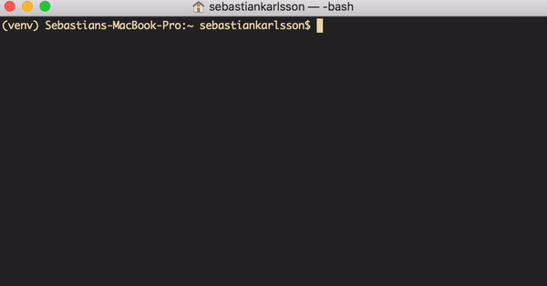

# morsetalk
> Library and Command Line tool to encode and decode Morse Code.

## Extended
> The morse code used in this software is extended by using:  
> [https://github.com/agwells/dotdash-keyboard-android/wiki/Wells-extended-Morse-code](https://github.com/agwells/dotdash-keyboard-android/wiki/Wells-extended-Morse-code)

## To use the library:
> Very simple:

    import morsetalk.morse as morse

    
    print(morse.encode('hello world'))
    # .... . .-.. .-.. --- / .-- --- .-. .-.. -..

    print(morse.decode('.... . .-.. .-.. --- / .-- --- .-. .-.. -..'))
    # HELLO WORLD

## To use the Command Line interface
> Very simple:

    $ morsetalk --encode "hello world"
    > .... . .-.. .-.. --- / .-- --- .-. .-.. -..
    
    $ morsetalk --decode ".... . .-.. .-.. --- / .-- --- .-. .-.. -.."
    > HELLO WORLD

## To install
> Clone down the repository and run:

    python setup.py install

> Or run:

    pip install morsetalk
